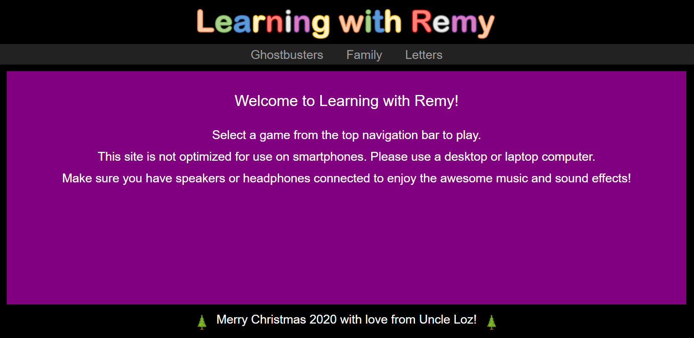
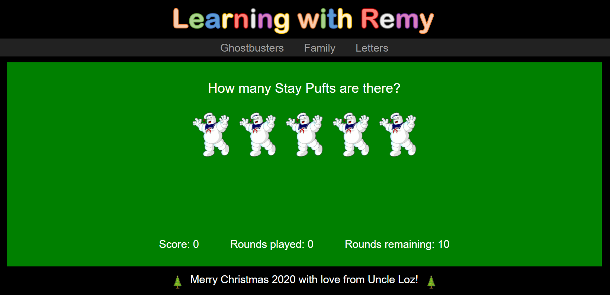

# Learning with Remy

Learning with Remy is a web-based counting game developed as a present for my nephew Remy (aged 5 at the time) for Christmas 2020.

## How to use

1. Go to [https://learning-with-remy.netlify.app/index.html](https://learning-with-remy.netlify.app/index.html).

2. Make sure you have speakers or headphones connected so that you can enjoy the awesome music and sound effects.
3. Select a either "Ghostbusters", "Family" or "Letters" from the top (Note: the "Family" game may be difficult for those not who do not know my family!).

4. Press any key to start the game, then use the number keys on your keyboard to answer the questions.

Note: The game is not optimized for use on smartphones, so please use a desktop or laptop computer.